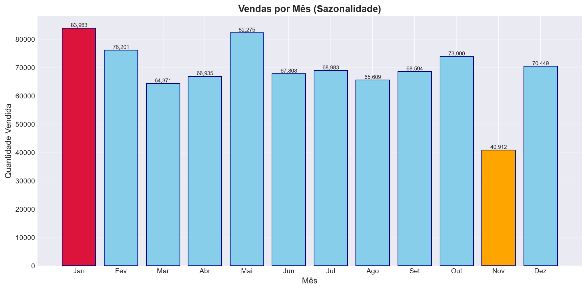
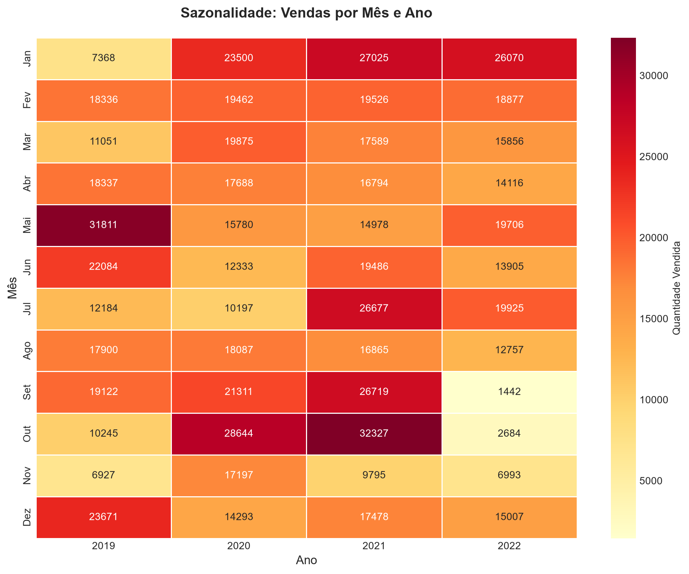
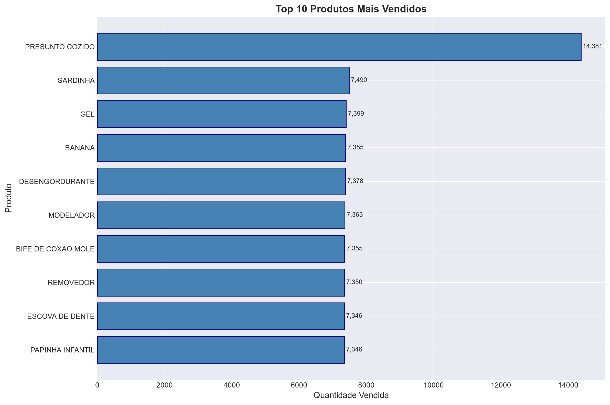
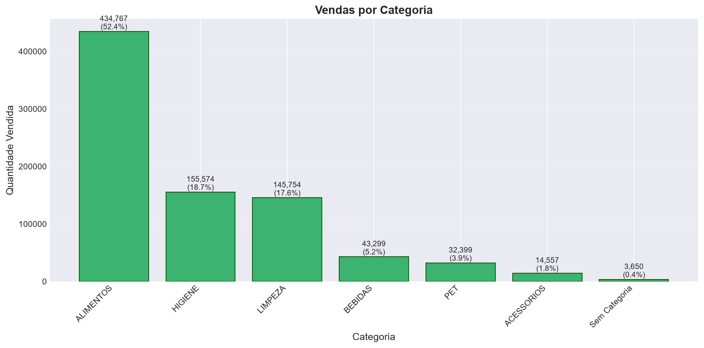
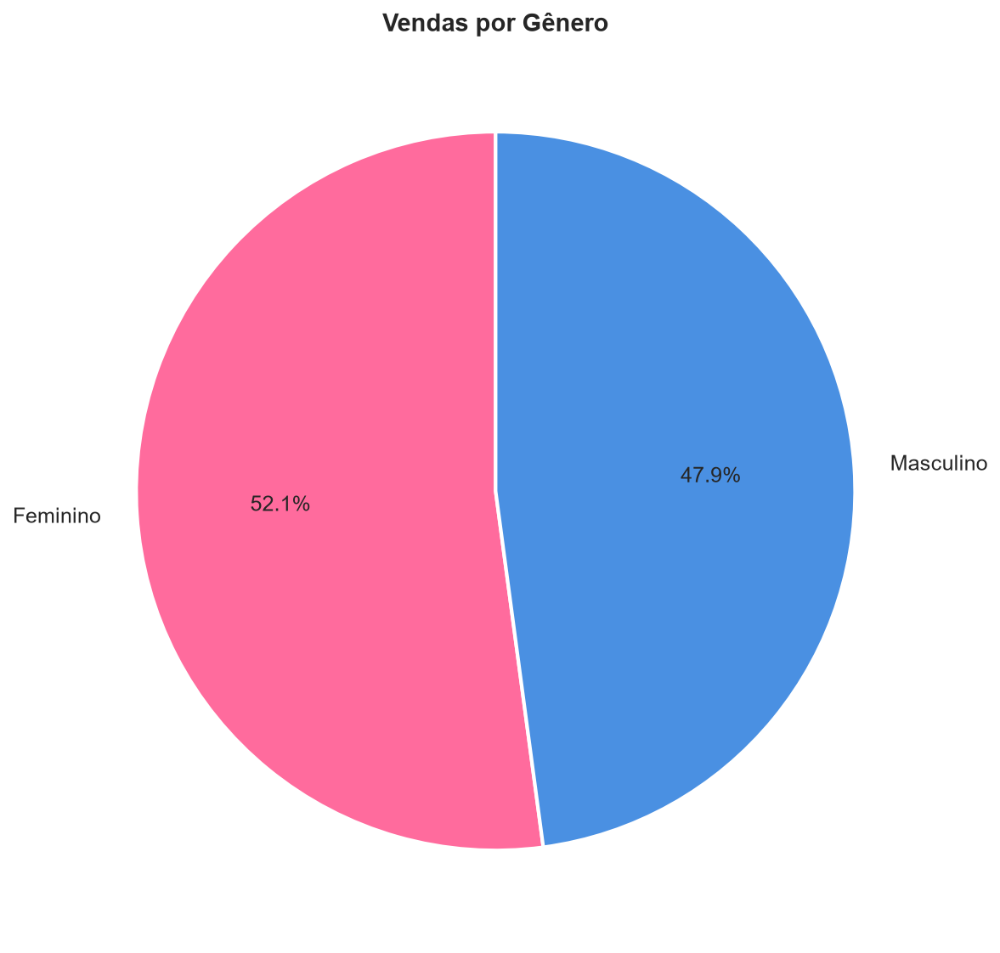
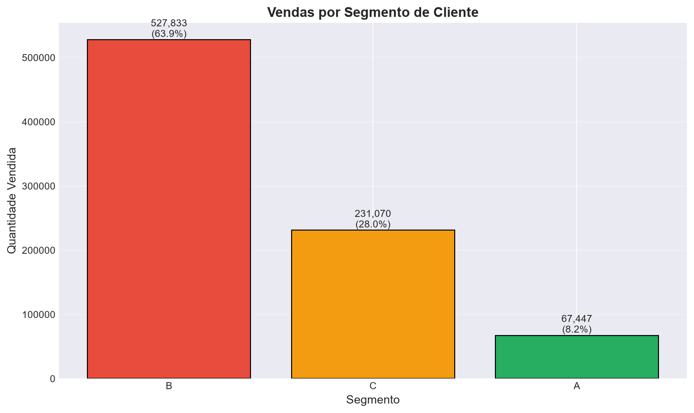

# Mini Desafio Semana 7 — Análise de Vendas do Setor Varejista


Análise exploratória de dados de vendas de uma rede de supermercados, com foco em sazonalidade, comportamento de compra e perfil do cliente.

**Curso:** SCTEC — Etapa Profissionalizar
**Autor:** [to-feature-or-not](https://github.com/to-feature-or-not)
**Data:** 2026-09-10

---

## 📋 Sobre o projeto

Este projeto realiza uma análise completa de um dataset com **830.000 registros** de vendas do setor varejista, cobrindo o período de **2019 a 2022**.

O pipeline inclui:

- Limpeza e tratamento de dados faltantes
- Conversão e validação de datas
- Detecção e agrupamento de duplicatas
- Análises de sazonalidade, produtos, categorias e clientes
- Geração de gráficos e relatórios

---

## 📁 Estrutura do projeto

```
sctec-mini-projeto-m1-s7/
├── README.md
├── requirements.txt
├── .gitignore
├── .gitattributes
├── mini_projeto_M1_S7.py
├── docs/
│   └── enunciado_mini_projeto_M1_S7.pdf
└── data/
    ├── raw/
    │   └── varejo.csv
    ├── processed/
    │   └── varejo_final.csv
    └── output/
        ├── run_*.log
        └── grafico_*.png
```

---

## 🛠️ Tecnologias Utilizadas

- **Python 3.14**
- **pandas** — manipulação e análise de dados
- **matplotlib** — visualização de dados
- **seaborn** — heatmap de sazonalidade

---

## 🚀 Como executar

### 1. Clonar o repositório

```bash
git clone https://github.com/to-feature-or-not/mini_desafio_semana7_SCTEC.git
cd mini_desafio_semana7_SCTEC
```

### 2. Criar ambiente virtual (recomendado)

```bash
python -m venv .venv
```

No Windows:

```bash
.venv\Scripts\Activate.ps1
```

No Linux/Mac:

```bash
source .venv/bin/activate
```

### 3. Instalar dependências

```bash
pip install -r requirements.txt
```

### 4. Executar o script

```bash
python mini_projeto_M1_S7.py
```

Os resultados serão salvos em `data/output/` (gráficos + log) e `data/processed/` (CSV final).

---

## 🧹 Etapas do pipeline

| Etapa | Descrição |
|-------|-----------|
| 1. Carregamento | Leitura do CSV original (830.000 registros) |
| 2. Exploração | Análise da estrutura e amostra dos dados |
| 3. Limpeza | Remoção de colunas vazias e valores `#N/D` |
| 4. Datas | Conversão e validação de datas |
| 5. Duplicatas | Agrupamento em coluna `QUANTITY` |
| 6. Análise | Sazonalidade, produtos, categorias, clientes |
| 7. Visualização | 6 gráficos gerados automaticamente |
| 8. Relatório | Log completo + conclusões |

---

## 📊 Principais Insights

1. **Produto mais vendido:** Presunto Cozido (14.381 unidades)
2. **Categoria mais vendida:** Alimentos (52,6% das vendas)
3. **Mês com mais vendas:** Janeiro (83.587 unidades)
4. **Ano com mais vendas:** 2021 (244.172 unidades)
5. **Gênero com mais compras:** Feminino (52,1% das vendas)
6. **Segmento principal:** B (63,9% das vendas)
7. **Média de itens por compra:** 44,74 itens
8. **Top produto está distribuído** entre 1.000 clientes únicos (não concentrado)

### 🛍️ Preferências por gênero

- **Mulheres (F):** Presunto Cozido, Sardinha, Detergente, Chupeta, Removedor
- **Homens (M):** Presunto Cozido, Banana, Refrigerante, Preservativo, Bife de Coxão Mole

---

### 📸 Visualizações

**Vendas por mês (sazonalidade):**


**Heatmap de sazonalidade (mês × ano):**


**Top 10 produtos mais vendidos:**


**Vendas por categoria:**


**Distribuição por gênero:**


**Vendas por segmento de cliente:**


## 📈 Gráficos gerados

| Arquivo | Descrição |
|---------|-----------|
| `grafico_sazonalidade.png` | Vendas por mês (barras) |
| `grafico_heatmap_sazonalidade.png` | Heatmap mês × ano (seaborn) |
| `grafico_top_produtos.png` | Top 10 produtos (barras horizontais) |
| `grafico_categorias.png` | Vendas por categoria |
| `grafico_genero.png` | Distribuição por gênero (pizza) |
| `grafico_segmento.png` | Vendas por segmento de cliente |

---

## 📝 Notas sobre os dados

### 🏷️ Produto sem cadastro

Todos os valores `#N/D` (3.650 registros, 0,44%) pertenciam a um único produto (`PR_ID = 107`), que não tinha nome nem categoria registrados.

- **Decisão:** remover esses registros (impacto mínimo, produto sem informação útil).
- **Recomendação:** completar o cadastro do produto 107 na base de origem.

### 📅 Cobertura por ano

| Ano | Registros |
|-----|-----------|
| 2019 | 175.325 (24,0%) |
| 2020 | 191.978 (26,3%) |
| 2021 | 215.850 (29,6%) |
| 2022 | 147.066 (20,1%) |

2022 tem menos registros que os outros anos — vale investigar se é uma lacuna real ou apenas dado incompleto.

### 🔍 Distribuição do `#N/D`

- A distribuição de `#N/D` por data mostra valores repetidos (24, 26, 25...)
- Isso sugere que os dados podem ser sintéticos ou gerados aleatoriamente

---

## ⚠️ Limitações

- Sem coluna de preço → não é possível analisar faturamento
- `QUANTITY` inferida a partir de duplicatas (pode não ser 100% precisa)
- 2022 com menos dados que os demais anos

---

## 📌 Recomendações

1. Obter dados de preço para análises financeiras
2. Validar com a fonte se as duplicatas são realmente quantidade de produtos
3. Investigar a lacuna de dados em 2022
4. Completar o cadastro do produto 107 no sistema de origem

---

## 📄 Licença

Este projeto está sob a licença MIT. Veja o arquivo [LICENSE](LICENSE) para mais detalhes.

---

## 👤 Autor

**Mariela Cantero** — [@to-feature-or-not](https://github.com/to-feature-or-not)
Mini-projeto avaliativo — Setembro/2026